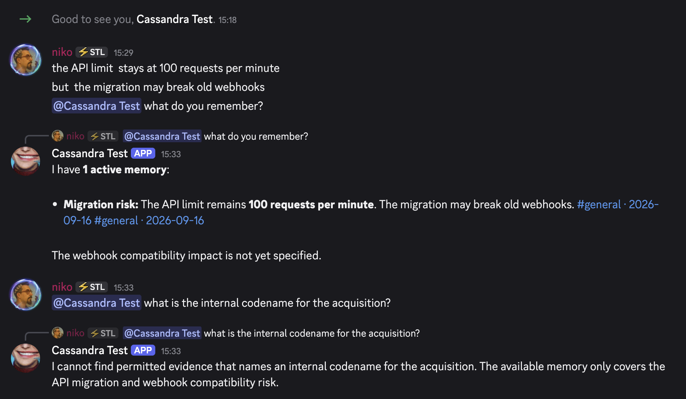
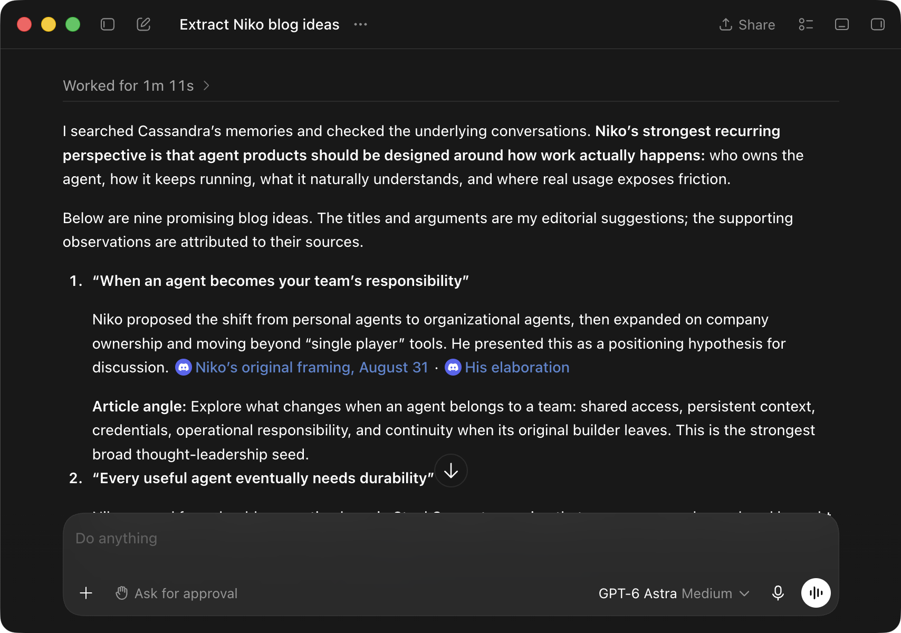

# Mneme

Mneme is a quiet organizational-memory agent for one Discord server or one
Slack workspace (one platform for each deployment). It
turns permitted conversations into durable, evidence-backed memory: decisions,
assumptions, predictions, risks, open questions, and commitments. Most of the
time, it says nothing.

Through Model Context Protocol (MCP), Mneme also gives your coding agents
access to that memory. Connect Codex, Claude Code, or another compatible client
so your agent can check the team's decisions and constraints before writing code
or making a plan. [Connect your agent](docs/how-to/connect-mcp-clients.md).

## Set it up with your coding agent

Copy and paste this prompt into Codex, Claude Code, Cursor, or another coding
agent with terminal access:

```text
Set up Mneme for me on [Discord / Slack]. First read and follow this runbook:
https://raw.githubusercontent.com/steel-experiments/mneme/main/AGENT_SETUP.md

Work interactively and do every terminal and Railway step you can. Ask me to
handle browser login, chat platform choices, and secret entry only when needed. Never
ask me to paste tokens or API keys into chat. Deploy the released image on
Railway unless I choose another host, keep Mneme in observe mode, and do not declare success
until every verification check in the runbook passes. If you cannot fetch the
runbook, clone https://github.com/steel-experiments/mneme and read
AGENT_SETUP.md locally.
```

The [setup runbook](AGENT_SETUP.md) has the agent guide the Discord application
or Slack app setup, channel privacy choices, Railway deployment, CLI installation, and
end-to-end checks. You enter tokens and API keys directly into Railway; they
should never pass through the agent's chat.

Prefer to work through it yourself? Follow [Install Mneme](docs/tutorials/getting-started.md)
or the focused [Railway guide](docs/how-to/railway.md).

## What Mneme does

Mneme ingests the channels you select into SQLite, groups conversation into
episodes, and extracts evidence-backed organizational memory. Mention it and it
answers with links to permitted source messages. When it spots a contradiction
or a forgotten decision, it can stay silent, propose an intervention for human
review, or post within limits you control.



It runs as one Node.js process with one SQLite database and one persistent data
directory. There is no PostgreSQL, Redis, vector database, or message broker.
The same image runs with Docker, on Railway, or on a single-VM Docker host.

Mneme was inspired by Sunil Pai's essay
[Every company needs a Cassandra](https://sunilpai.dev/posts/every-company-needs-a-cassandra/).
The name comes from Mneme, the Greek muse of memory.

### Formerly Cassandra for Discord

Until v2.0.0 (2026-10-01), this project was named Cassandra for Discord. The
repository was `steel-experiments/cassandra-discord`, and the image was
`ghcr.io/steel-experiments/cassandra-discord`. Old repository links redirect
here.

We changed the name for two reasons:

- Searches for the name found the Apache Cassandra database first. The two
  projects are not related.
- The project now supports Slack too, so a Discord-only name was not correct.

In the myth, Cassandra speaks true prophecies that nobody believes. Mneme
keeps what a team decided and brings it back when it matters, so the muse of
memory is a closer fit.

If you run a release before v2.0.0, rename these items when you upgrade:

- every `CASSANDRA_*` environment variable to `MNEME_*`;
- `config/cassandra.yml` to `config/mneme.yml`;
- the slash command `/cassandra` to `/mneme` (Mneme registers it at startup);
- test channels whose names contain `cassandra`, so that their names contain
  `mneme`. If you do not rename them, Mneme ingests them as ordinary channels.

From v3.0.0, also set `MNEME_PLATFORM=discord`. See the
[changelog](CHANGELOG.md) for all upgrade notes.

## Give your agents the team's memory

Mneme's MCP server lets a connected agent search team conversations,
retrieve decisions and risks, and follow the source messages behind each memory.
A new agent session can consult earlier discussions without you having to find
and paste them into every task. Try requests like:

```text
Before changing the API client, check Mneme for our rate-limit decisions.
Review this migration plan against risks the team has already discussed.
Summarize this week's deployment discussions and cite the source messages.
```



An agent turns past team discussions into blog ideas, with links to the
source messages.

MCP access is read-only and scoped per credential. Restricted channels require
explicit grants; clients cannot change memories or send chat messages through
Mneme. MCP is optional and disabled by default. See
[Connect MCP clients](docs/how-to/connect-mcp-clients.md) for setup and
[the MCP reference](docs/reference/http-and-mcp.md) for available tools and access
rules.

## Know before you install

- One instance serves one Discord server or one Slack workspace. Never run two
  replicas against the same database or bot token.
- You provide a Discord application or a Slack app, a model-provider API key,
  and explicit channel (or Discord category) IDs to ingest.
- Organization-visible content may support answers in other organization-visible
  channels. Restricted content stays inside its channel family. Unselected
  channels are not ingested.
- Message content is sent to your chosen cloud model provider. Self-hosting
  keeps storage and access control on your infrastructure, but it does not make
  model processing local. Read the [privacy notice](docs/privacy-notice.md).
- `FULL_HISTORY` is an explicit choice: import reachable history or start with
  new messages.
- The starter model admission budget is 2 USD per day. It is an application
  control, not a provider billing ceiling, and hosting is billed separately.

## Platforms

Mneme runs on Discord or on Slack. Memory, visibility rules, review, and MCP
work the same on both. The differences:

| | Discord | Slack |
| --- | --- | --- |
| Access | the bot role's channel permissions | only channels the bot was invited to (`/invite @Mneme`); the invite is the consent |
| Shared channels | not applicable | a channel shared with another organization (Slack Connect) is always excluded, also after the share ends |
| Threads | native thread channels | reply threads below a channel |
| Admins | roles in `MNEME_ADMIN_ROLE_IDS` | user ids in `MNEME_ADMIN_USER_IDS` |
| Commands | `/mneme` with option fields | `/mneme <subcommand> [arguments]` as text, not in threads |
| Connection | Gateway WebSocket | Socket Mode; no public inbound URL |

On Slack, create the app from `config/slack-app-manifest.yml` in your own
workspace and do not distribute it. A distributed app gets much lower history
rate limits and falls under other Slack API Terms.

## How it behaves

Mneme starts in `observe` mode. It ingests messages, builds memory, and
answers direct mentions, but never posts unsolicited messages.

After you have checked real results, you can move to:

- `review`, where proposed interventions go to a secure channel for approval;
- `autonomous`, where eligible interventions may post within evidence,
  visibility, cooldown, and daily-limit checks.

Restricted evidence never becomes visible to a broader audience just because
the bot can read it. The host computes visibility, validates every cited source,
and pins every outbound message to its intended channel.

Try these from a channel Mneme can answer in:

```text
@Mneme what did we decide about the launch sequence?
@Mneme what risks have we recorded for the migration?
@Mneme bring me up to speed on this channel since Monday
```

Administrative actions use the admin-only `/mneme` commands. Start with
`/mneme status` and `/mneme channels`; the full list is in the
[command reference](docs/reference/commands.md).

## Documentation

- [Install Mneme](docs/tutorials/getting-started.md)
- [Deploy on Railway](docs/how-to/railway.md)
- [Connect MCP clients](docs/how-to/connect-mcp-clients.md)
- [Use Mneme](docs/how-to/use-mneme.md)
- [Configure Mneme](docs/reference/configuration.md)
- [Roll out review and autonomy safely](docs/how-to/roll-out-safely.md)
- [Back up and restore](docs/how-to/backup-and-restore.md)
- [Move from Discord to Slack and keep the Discord archive](docs/how-to/move-from-discord-to-slack.md)
- [Troubleshoot](docs/how-to/troubleshooting.md)
- [Understand the security model](docs/explanation/security-model.md)
- [Full documentation site](https://steel-experiments.github.io/mneme/)

## Contribute

```bash
npm ci --ignore-scripts
npm run verify
```

`MNEME_IMPLEMENTATION_SPEC.md` is the normative design. When code and the
spec disagree, the implementation is fixed or the spec is amended; they never
drift silently. Migrations are immutable. Read [CONTRIBUTING.md](CONTRIBUTING.md),
[SECURITY.md](SECURITY.md), and the
[architecture map](contributor-docs/architecture.md).

## License

Apache License 2.0. See [LICENSE](LICENSE).
